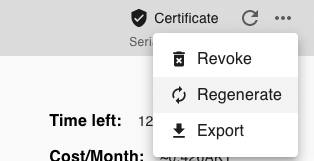
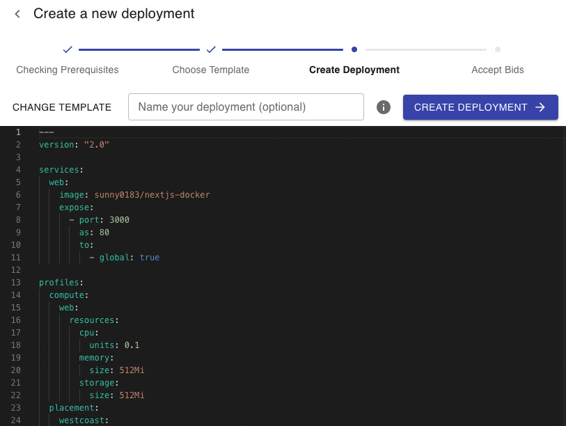
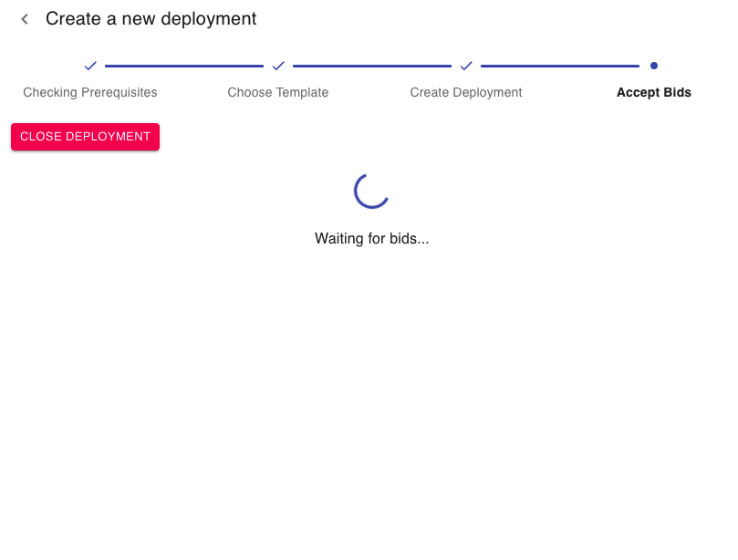
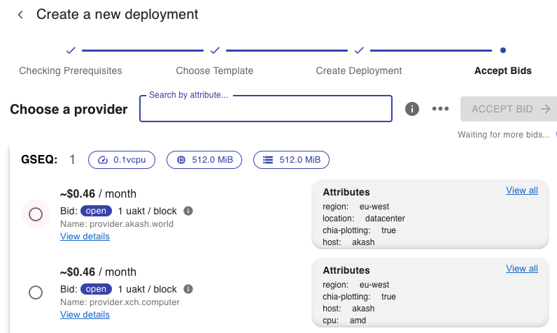
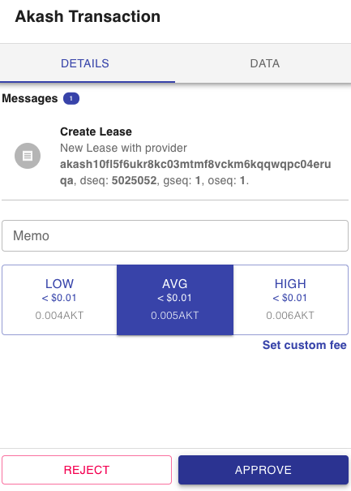
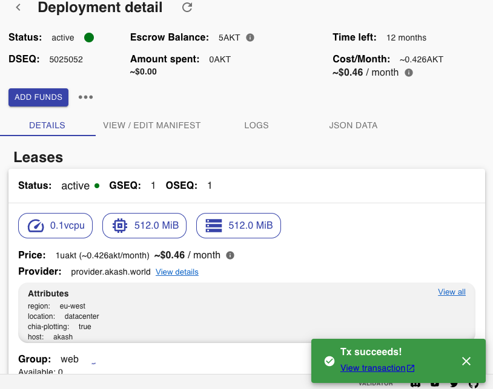
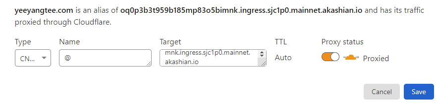
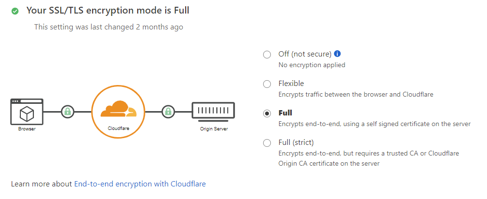
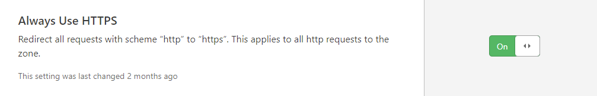

# NextJS With Akash

This example shows how to use Docker with Next.js based on the [deployment documentation](https://nextjs.org/docs/deployment#docker-image). Additionally, it contains instructions for deploying to Akash.

## How to use

Execute [`create-next-app`](https://github.com/vercel/next.js/tree/canary/packages/create-next-app) with [npm](https://docs.npmjs.com/cli/init) or [Yarn](https://yarnpkg.com/lang/en/docs/cli/create/) to bootstrap the example:

```bash
npx create-next-app --example with-docker nextjs-docker
# or
yarn create next-app --example with-docker nextjs-docker
```

Or use this the `nextjs-akash-boilerplate` project in this repo which was started with that command

## Using Docker

1. [Install Docker](https://docs.docker.com/get-docker/) on your machine.
1. Build your container: `docker build -t <yourusername>/nextjs-akash .`.
1. Run your container: `docker run -p 3000:3000 nextjs-docker`.

You can view your images created with `docker images`.

## Running Locally

First, run the development server:

```bash
npm run dev
# or
yarn dev
```

Open [http://localhost:3000](http://localhost:3000) with your browser to see the result.

You can start editing the page by modifying `pages/index.js`. The page auto-updates as you edit the file.

[API routes](https://nextjs.org/docs/api-routes/introduction) can be accessed on [http://localhost:3000/api/hello](http://localhost:3000/api/hello). This endpoint can be edited in `pages/api/hello.js`.

The `pages/api` directory is mapped to `/api/*`. Files in this directory are treated as [API routes](https://nextjs.org/docs/api-routes/introduction) instead of React pages.


## Deploying to Akash Network

### Using the Akash CLI 

1. Install the [Akash Command Line Tool](https://docs.akash.network/guides/cli/part-1.-install-akash) so you can use `akash` on the command line.
2. Configure the environment variables to setup your account for deployment.
3. [Create a new certificate](https://docs.akash.network/guides/cli/part-6.-create-your-certificate) using the Akash CLI: 

```
akash tx cert create client --chain-id $AKASH_CHAIN_ID --keyring-backend $AKASH_KEYRING_BACKEND --from $AKASH_KEY_NAME --node $AKASH_NODE --gas-prices="0.025uakt" --gas="auto" --gas-adjustment=1.15
```

4. Build your container image using Docker:  
   `docker build -t <yourusername>/nextjs-akash .`. 
5. Push your container image to a PUBLIC repository:  
    `docker push <yourusername>/nextjs-akash`. This will enable Akash deployments to utilize your image. Currently only public images are supported which may be fine if you are making a public service anyways. Ensure you follow best practices for container security.
6. Create a deployment file which will describe the units you will need as well as the image you will use. You can find a quickstart example in `deploy.yaml` with an already public image if you are just testing. For example if you want to deploy the `lunie-light` image you can use this example deployment file from the [Akash docs](https://docs.akash.network/guides/cli/part-5.-create-your-configuration) :

```
curl -s https://raw.githubusercontent.com/ovrclk/docs/master/guides/deploy/deploy.yml > deploy.yaml
```

7. Begin a deployment to Akash. Follow the Akash guide from [part 7-10](https://docs.akash.network/guides/cli/part-7.-create-your-deployment). 
Example command
```
akash tx deployment create deploy.yml --from $AKASH_KEY_NAME --node $AKASH_NODE --chain-id $AKASH_CHAIN_ID --gas-prices="0.025uakt" --gas="auto" --gas-adjustment=1.15
```
8. View your newly deployed NextJS app! The URI will be included in the response of `akash provider lease-status` command noted in [step 10](https://docs.akash.network/guides/cli/part-10.-send-the-manifest) of the Akash guide


### Using the Akashlytics Deploy App

The Akashlytics Deploy App provides a more graphical way to get your deployment into the Akash network. Rather than using the CLI, the Akashlytics Deploy App enables you to do all the actions you need to deploy a resource. This method may be more suitable to those who prefer to stay away from the command line. 

To get started, download Akashlytics Deploy App from Akash website, install it and input a mnemonic to be used for deployments. This can be a fresh mnemonic as long as you send the 5 or so AKT needed to get the deployments done. 

Assuming you have installed the app, setup a wallet and funded it; head to either the deployments tab or the templates tab. 

> Templates provide a number of community submitted deployments for various services to save you time in trying to figure out how to deploy basic things such as wordpress. This repo has been submitted to eventually be added to this templates list and you can find the [full list of templates here](https://github.com/ovrclk/awesome-akash)

Sticking with the deployments option, lets create a new deployment. In order to do so you will need a valid certificate both locally and on chain. Lets assume you don't have this. You can generate or regenerate a certificate with the App by clicking the options next to the Certificate badge and selecting either generate or regenerate.



Remember you will need to have at least 5 AKT in the wallet you have signed in to the app in order to create a deployment 


We can now select either to deploy from a template, a git resource or in our case we will just use the file included with this repo. Provide this file via the local option or git and you should see something similar to the this:



Next, after providing your deployment file you should begin to see bids coming in. If for some reason you don't see any bids ever coming in, this suggests theres a problem with your deployment file. In my case I was missing a `signedOff` key in the deployment template.



In most cases you will start to see bids coming in from various providers as well as the rate they can offer you. Select one of these providers and submit a transaction to create a lease: 





Assuming no issues with the lease transaction, after some time you should now see a success message as well as the final deployment details for your deployment including its ongoing costs 




### Setting up a custom domain with SSL

After doing your first successful deploy, take a moment. You have already achieved so much by getting NextJs into the Akash network. Two problems remains which are 1. Your uri is not the best to share and market around and 2. HTTPS with secured connections aren't right but we can fix both of these by getting a custom domain and putting cloudflare in front of it. 

For the custom domain I use NameCheap but you are free to choose as long as they play nice with cloudflare which will be what handles SSL and HTTPS. 

After you have your domain you need to create a cloudflare account and add your website. A free account should do and for instructions on setting up the website head [here](https://support.cloudflare.com/hc/en-us/articles/201720164-Creating-a-Cloudflare-account-and-adding-a-website)

Next, head to your newly added domain and add a new CNAME DNS record for the Akash uri :



While in the management panel, scroll down and ensure your SSL and TLS are set to 'FULL'



Under the SSL/TLS Tab, navigate to Edge Certificates. Make sure ‘always use HTTPS’ is enabled.



You can now visit your custom domain. When you do so it will redirect to your Akash deployment uri but this time with HTTPS available and with a proper SSL cert. 

Reference -- I got some of these images from this [great article](https://teeyeeyang.medium.com/how-to-use-a-custom-domain-with-your-akash-deployment-5916585734a2)